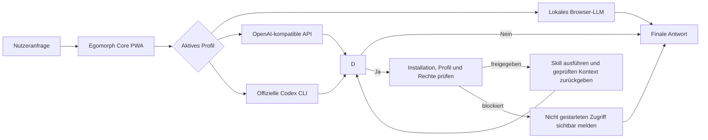

# Egomorph Core

> **Ein lokales Kontrollzentrum für agentische KI:** ein installierbares Browser-Interface, drei austauschbare Modellwege und ein transparentes, berechtigungsbasiertes Skill-System.

[English version](README_EN.md) · [Ausführliche Dokumentation](doku.md) · MIT-Lizenz

Egomorph Core verbindet ein lokales Browser-LLM, OpenAI-kompatible APIs und die offizielle Codex CLI in einer einzigen PWA. In den agentischen API- und Codex-Profilen entscheidet das aktive Modell semantisch, ob es einen freigegebenen Skill benötigt. Jeder echte Zugriff wird sichtbar, Berechtigungen werden vor der Ausführung geprüft und private Arbeitsdateien bleiben in einem begrenzten lokalen Modell-Home.

**Kurz gesagt:** Egomorph Core macht aus verschiedenen KI-Backends einen nachvollziehbaren lokalen Agenten – ohne regelbasierte Antwortvorlagen, ohne vorgetäuschte Tool-Aufrufe und ohne eine Cloud-Bindung für die Benutzeroberfläche.

## Warum das Projekt besonders ist

- **Ein Interface, drei Modellwege:** lokal im Browser, über eine OpenAI-kompatible API oder über die offizielle Codex CLI.
- **Nachvollziehbare Agentenläufe:** Denkzusammenfassung, tatsächliche Skill-Zugriffe und finale Antwort werden live getrennt dargestellt.
- **Skills mit Least Privilege:** Installation, Aktivierung, Profile, Rechte und Setup werden manifestbasiert verwaltet.
- **Quellen-Provenienz statt Scheinbelegen:** Nur wirklich an das Modell übergebene Webquellen dürfen in die finale Antwort einfließen.
- **Lokaler Sicherheitsbereich:** Memory und Dateien liegen im Modell-Home; Pfad-Traversal, Secrets und geschützte Verzeichnisse bleiben blockiert.
- **Installierbare PWA:** lokale Unterhaltungen, Offline-App-Shell, Writer-Agent und eine auf Desktop wie Mobilgeräten nutzbare Oberfläche.

## So funktioniert es



Pro Modellschritt ist höchstens ein Skill-Aufruf erlaubt. Für komplexe Aufgaben kann der Agent mehrere geprüfte Zugriffe nacheinander ausführen; der aktuelle Turn ist auf sechs Zugriffe begrenzt. Die angezeigte Denkantwort ist eine kurze, ergebnisorientierte Zusammenfassung – keine private Chain-of-Thought.

## Voraussetzungen und Abhängigkeiten

### Erforderlich

| Abhängigkeit | Zweck |
| --- | --- |
| [Node.js](https://nodejs.org/) mit npm | Startet Dashboard und lokales Gateway. Eine aktuelle LTS-Version wird empfohlen. |
| Moderner Browser | Führt die PWA aus; Chrome oder Edge bieten für lokale Modelle meist die beste Kompatibilität. |
| Internetzugang bei der Einrichtung | Lädt npm-Pakete sowie bei Bedarf Transformers.js und ein ausgewähltes Browser-Modell. |

Die einzigen npm-Entwicklungsabhängigkeiten des Projekts sind Jest und TypeScript. Für den normalen API- oder Codex-Betrieb sind weder Python noch Docker erforderlich.

### Nur für das gewählte Profil

| Profil/Funktion | Zusätzlich erforderlich |
| --- | --- |
| **Lokal** | Eine kompatible Hugging-Face-Modell-ID; Downloadgröße, RAM und Geschwindigkeit hängen vom Modell und Gerät ab. |
| **API** | URL eines OpenAI-kompatiblen Endpunkts, Modellname und – falls erforderlich – API-Key. Unterstützt werden unter anderem OpenAI, OpenRouter, Ollama und LM Studio. |
| **Codex** | Installierte offizielle Codex CLI und eine gültige Anmeldung. |
| **Google-Recherche** | Optional: Google Programmable Search API-Key und Search Engine ID. Ohne diese Daten nutzt der Internet-Skill seine Fallback-Provider. |

Codex CLI installieren:

```bash
npm install -g @openai/codex@latest
codex --version
```

Die Installationsform folgt dem [offiziellen OpenAI-Codex-Beispiel](https://developers.openai.com/cookbook/examples/codex/secure_quality_gitlab#code-quality-cicd-job-example). Egomorph Core übernimmt keine Cookies, Access-Tokens oder `auth.json`; die Anmeldung läuft ausschließlich über die offizielle CLI.

## Schnellstart

```bash
npm install
./egomorph codex login
./egomorph dashboard
```

Danach öffnet sich das Dashboard standardmäßig unter [http://localhost:8787/](http://localhost:8787/).

Falls der normale Browser-Login nicht möglich ist:

```bash
./egomorph codex login --device-auth
```

Nützliche Befehle:

```bash
./egomorph codex status   # Anmeldung prüfen
./egomorph dashboard      # Gateway starten und Browser öffnen
./egomorph gateway        # Gateway ohne automatisches Öffnen starten
./egomorph clean          # App-Cache und Service Worker bereinigen
```

> Die Codex-Anmeldung ist nur für das Codex-Profil nötig. Wer ausschließlich ein lokales Modell oder einen API-Endpunkt verwendet, kann diesen Schritt überspringen.

## Die drei Profile

| Profil | Antwortquelle | Geeignet für |
| --- | --- | --- |
| **Lokal** (`full`) | Transformers.js-Modell direkt im Browser | Datenschutz, Offline-Nutzung nach dem Modelldownload und Experimente auf dem eigenen Gerät |
| **API** (`api`) | OpenAI-kompatibler Chat-Completions-Endpunkt | Freie Provider- und Modellwahl, lokale Server oder gehostete APIs |
| **Codex** (`codex`) | Offizielle Codex CLI über den lokalen App-Server | Agentische Aufgaben, dynamischer Modellkatalog, Streaming und Codex-Websuche |

## Einen eigenen Skill in Egomorph Core installieren

### Was „installieren“ aktuell bedeutet

Egomorph Core lädt aus Sicherheitsgründen keine beliebigen Skill-Dateien aus dem Browser. Ein selbst geschriebener Skill wird zuerst einmalig in der Codebasis registriert. Danach erscheint er im Skill-Katalog und kann von jedem Nutzer vollständig über **Einstellungen → Skills** installiert, aktiviert, konfiguriert und pro Profil berechtigt werden.

Ein Skill benötigt mindestens:

1. ein Manifest unter `skills/<skill-id>/manifest.json`,
2. einen Browser-Einstiegspunkt, zum Beispiel `skills/<skill-id>/index.js`,
3. eine Runtime-Anbindung an den generativen Agentenloop,
4. die Freigabe seiner statischen Dateien durch Gateway und PWA,
5. Übersetzungen und Tests für die neue Integration.

### 1. Manifest anlegen

```json
{
  "schemaVersion": 1,
  "id": "example.my-skill",
  "name": "My Skill",
  "displayNameKey": "mySkillName",
  "descriptionKey": "mySkillDescription",
  "version": "1.0.0",
  "entrypoint": "skills/my-skill/index.js",
  "builtIn": false,
  "defaultEnabled": false,
  "profiles": ["api", "codex"],
  "permissions": [
    {
      "id": "network",
      "labelKey": "skillPermissionNetwork",
      "descriptionKey": "skillPermissionNetworkDescription",
      "required": true,
      "defaultGranted": false
    }
  ],
  "setup": [
    {
      "id": "endpoint",
      "type": "text",
      "labelKey": "mySkillEndpointLabel"
    }
  ]
}
```

Pflichtfelder sind `schemaVersion`, `id`, `name`, `version`, `entrypoint`, `profiles` und `permissions`. `id` sollte stabil und eindeutig sein, `version` semantischer Versionierung folgen. Optionale `setup`-Felder erzeugen automatisch Eingaben in der Skill-Karte. Ein Setup-Feld mit `permission` wird nur dann an den Lauf weitergegeben, wenn dieses Recht erteilt ist.

Gültige Profile sind:

- `full` – lokales Browser-Modell; die Registry akzeptiert dieses Profil, ein eigener Skill benötigt dafür jedoch zusätzlich einen lokalen Tool-Loop. Die aktuellen eingebauten Skills verwenden `api` und `codex`.
- `api` – OpenAI-kompatibler Endpunkt
- `codex` – offizielle Codex-CLI-Anbindung

### 2. Einstiegspunkt implementieren

Der unter `entrypoint` angegebene Browser-Code stellt eine klar benannte Runtime-API bereit. Er validiert Eingaben, unterstützt nach Möglichkeit `AbortSignal`, gibt nur den minimal nötigen Kontext zurück und liest seine Konfiguration über `EgoSkillSystem.getConfigForRun(id)`. Secrets gehören niemals in Manifest oder Quelltext.

Die vorhandenen Referenzen zeigen beide typischen Muster:

- [`skills/internetSkill.js`](skills/internetSkill.js) – Netzwerkzugriff und aufbereitete Quellen
- [`skills/extendedFileSkill.js`](skills/extendedFileSkill.js) – berechtigungsgetrennte Gateway-Operationen
- [`skills/learnWithEgomorphSkill.js`](skills/learnWithEgomorphSkill.js) – adaptive Tutor-Regeln ohne vorgefertigte Antworten

### 3. Manifest registrieren

Den Pfad des neuen Manifests in `MANIFEST_URLS` in [`skillSystem.js`](skillSystem.js) ergänzen. Erst bekannte Manifeste werden validiert und im Skill-Katalog angezeigt.

### 4. Agentenloop anbinden

Das Manifest allein beschreibt Verwaltung und Rechte, aber noch nicht die Semantik der Ausführung. In [`resourceProfile.js`](resourceProfile.js) müssen deshalb gezielt ergänzt werden:

- das strukturierte `<egomorph_skill_request>`-Format des Skills,
- strikte Validierung der erlaubten Parameter,
- die Verfügbarkeits- und Rechteprüfung,
- der eigentliche Runtime-Aufruf,
- ein begrenzter, bereinigter Rückgabekontext für den nächsten Modellschritt,
- echte `onSkillStart`, `onSkillUse`, `onSkillError` oder Blockiert-Ereignisse.

Unbekannte oder ungültige Modellaufrufe dürfen niemals ausgeführt werden. Ein Skill gilt nur dann als nutzbar, wenn er installiert und aktiviert ist, das aktuelle Profil freigegeben ist und alle erforderlichen Rechte vorliegen.

### 5. Dateien für Gateway und PWA freigeben

Die Manifest- und Einstiegspunktdateien müssen in `DEFAULT_DASHBOARD_FILES` in [`scripts/codex-bridge.js`](scripts/codex-bridge.js) sowie in `URLS_TO_CACHE` in [`sw.js`](sw.js) aufgenommen werden. Anschließend `CACHE_NAME` in `sw.js` erhöhen. Ohne diese Schritte kann das Gateway die Dateien ablehnen oder eine installierte PWA eine veraltete App-Shell verwenden.

### 6. UI-Texte und Tests ergänzen

Neue Übersetzungs-Keys müssen identisch in [`translations/de.js`](translations/de.js), [`translations/en.js`](translations/en.js) und [`translations/fr.js`](translations/fr.js) vorhanden sein. Mindestens testen:

- Manifestvalidierung und Standardzustand,
- Installation, Aktivierung, Profile und Rechte,
- erlaubte, blockierte und fehlerhafte Ausführung,
- Eingabevalidierung und Abbruch,
- Bereinigung des an das Modell übergebenen Kontexts.

### 7. Im Browser installieren

Nach dem Neustart von `./egomorph dashboard`:

1. **Einstellungen → Skills** öffnen.
2. Beim neuen Skill **Installieren** wählen.
3. **Aktivieren** einschalten.
4. Erlaubte Profile auswählen.
5. Nur die benötigten Rechte erteilen.
6. Manifestdefinierte Setup-Felder ausfüllen und speichern.
7. Mit einer Anfrage testen, die den Skill semantisch wirklich benötigt.

Der persistente Skill-Zustand bleibt lokal im Browser unter `egoSkillStatesV1`. Eine Deinstallation sperrt neue Ausführungen sofort.

## Eingebaute Skills

### Internet Research

`internet.research` recherchiert über Google Programmable Search oder Fallback-Provider. Netzwerkzugriff ist erforderlich; lokale Google-Zugangsdaten besitzen ein separates, optionales Recht. Die UI meldet die Anzahl der Quellen, die tatsächlich für den finalen Modellschritt aufbereitet wurden.

### Extended Project Files

`workspace.extended-files` ist standardmäßig deaktiviert. Lese- und Schreibrecht werden getrennt erteilt. Selbst mit Freigabe sind nur `.js`, `.css`, `.html` und `.py` innerhalb des Modell-Homes erlaubt; `.env*`, `.git`, `node_modules`, externe Pfade und ausbrechende Symlinks bleiben gesperrt.

### Learn with EgoMorph

`learning.egomorph` ist für API und Codex eingebaut und benötigt keine zusätzlichen Rechte. Der Skill startet eine adaptive, spielerische Lernschleife für JavaScript und TypeScript anhand der EgoMorph-Architektur: Bei unbekanntem Niveau fragt das Modell zuerst danach, danach erzeugt es passende Erklärungen, Quizfragen, Debugging- und Implementierungsaufgaben sowie Hinweise aus dem aktuellen Gespräch. Es gibt keinen fest codierten Antwort- oder Lösungskatalog. Exakte Codezugriffe bleiben getrennten, ausdrücklich freigegebenen Skills vorbehalten.

## Sicherheit und Datenschutz

- Das Gateway bindet standardmäßig ausschließlich an `127.0.0.1:8787`.
- Andere Browser-Origins müssen explizit über `CODEX_BRIDGE_ALLOWED_ORIGINS` erlaubt werden.
- Das Modell-Home liegt unter `<Projektordner>/EgomorphCore/model-home`.
- `memory.md` ist für persistentes Memory reserviert.
- Browser-Uploads akzeptieren kontrollierten Markdown-Kontext.
- Interne Dateien, Pfade, Rohinhalte, System-Prompts und Secrets werden nicht als Agentenantwort ausgegeben.
- Gateway- und API-Routen werden nicht durch den Service Worker gecacht.

Das Gateway sollte ohne vorgeschaltete Authentifizierung niemals öffentlich ins Netz gestellt werden.

## Entwicklung und Verifikation

```bash
npm test -- --runInBand
npm run build:safetyfilter
npm run pwa:validate
```

Wichtige Einstiegspunkte:

| Datei | Aufgabe |
| --- | --- |
| [`resourceProfile.js`](resourceProfile.js) | Profile, API-/Codex-Dispatch und Agentenloop |
| [`skillSystem.js`](skillSystem.js) | Manifest-Registry, Installation, Rechte und Konfiguration |
| [`scripts/codex-bridge.js`](scripts/codex-bridge.js) | Lokales Gateway, Codex App Server und Modell-Home |
| [`agentResponse.js`](agentResponse.js) | Live-Darstellung und sichere Antwortaufteilung |
| [`conversationStore.js`](conversationStore.js) | Versionierte lokale Unterhaltungen |
| [`Writer.js`](Writer.js) | Integrierter Writer-Agent |

Die vollständige technische Referenz steht in [`doku.md`](doku.md). Egomorph Core wird unter der **MIT-Lizenz** veröffentlicht.
