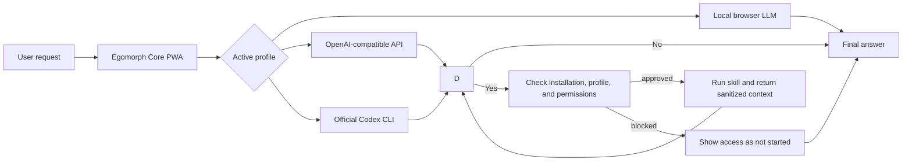

# Egomorph Core

> **A local control center for agentic AI:** one installable browser interface, three interchangeable model paths, and a transparent permission-based skill system.

[Deutsche Version](README.md) · [Detailed documentation](DOKUMENTATION_EN.md) · MIT License

Egomorph Core brings together a local browser LLM, OpenAI-compatible APIs, and the official Codex CLI in a single PWA. In the agentic API and Codex profiles, the active model decides semantically whether it needs an approved skill. Every real access is visible, permissions are checked before execution, and private working files stay inside a restricted local model home.

**In one sentence:** Egomorph Core turns different AI backends into an observable local agent—without rule-based response templates, simulated tool calls, or a cloud dependency for the user interface.

## Why this project stands out

- **One interface, three model paths:** run locally in the browser, through an OpenAI-compatible API, or through the official Codex CLI.
- **Observable agent runs:** reasoning summary, genuine skill accesses, and the final answer are presented as separate live stages.
- **Least-privilege skills:** installation, activation, profiles, permissions, and setup are driven by manifests.
- **Source provenance instead of decorative citations:** only web sources actually passed to the model may support the final answer.
- **A local security boundary:** memory and files live in the model home; path traversal, secrets, and protected directories remain blocked.
- **An installable PWA:** local conversations, an offline app shell, a Writer agent, and a responsive desktop/mobile interface.

## How it works



Only one skill may be requested per model step. For complex tasks, the agent can perform several approved accesses in sequence; the current limit is six accesses per user turn. The displayed reasoning is a short, outcome-focused summary—not private chain-of-thought.

## Requirements and dependencies

### Required

| Dependency | Purpose |
| --- | --- |
| [Node.js](https://nodejs.org/) with npm | Runs the dashboard and local gateway. A current LTS release is recommended. |
| Modern browser | Runs the PWA; Chrome or Edge generally provides the best compatibility for local models. |
| Internet access during setup | Downloads npm packages and, when selected, Transformers.js and a browser model. |

The project's only npm development dependencies are Jest and TypeScript. Normal API or Codex use requires neither Python nor Docker.

### Required only for the selected profile

| Profile/feature | Additional requirement |
| --- | --- |
| **Local** | A compatible Hugging Face model ID; download size, RAM use, and performance depend on the model and device. |
| **API** | An OpenAI-compatible endpoint URL, a model name, and an API key when required. OpenAI, OpenRouter, Ollama, and LM Studio are among the supported options. |
| **Codex** | The official Codex CLI and a valid login. |
| **Google research** | Optional Google Programmable Search API key and Search Engine ID. Without them, the internet skill uses fallback providers. |

Install the Codex CLI:

```bash
npm install -g @openai/codex@latest
codex --version
```

This installation method follows the [official OpenAI Codex example](https://developers.openai.com/cookbook/examples/codex/secure_quality_gitlab#code-quality-cicd-job-example). Egomorph Core never imports cookies, access tokens, or `auth.json`; authentication is delegated exclusively to the official CLI.

## Quick start

```bash
npm install
./egomorph codex login
./egomorph dashboard
```

The dashboard then opens at [http://localhost:8787/](http://localhost:8787/) by default.

If the normal browser login is unavailable:

```bash
./egomorph codex login --device-auth
```

Useful commands:

```bash
./egomorph codex status   # Check authentication
./egomorph dashboard      # Start gateway and open the browser
./egomorph gateway        # Start gateway without opening the browser
./egomorph clean          # Clear the app cache and service worker
```

> Codex authentication is needed only for the Codex profile. Skip that step when using only a local model or an API endpoint.

## The three profiles

| Profile | Response source | Best suited for |
| --- | --- | --- |
| **Local** (`full`) | Transformers.js model running in the browser | Privacy, offline use after model download, and on-device experimentation |
| **API** (`api`) | OpenAI-compatible Chat Completions endpoint | Provider/model choice, local servers, or hosted APIs |
| **Codex** (`codex`) | Official Codex CLI through the local App Server | Agentic tasks, dynamic model discovery, streaming, and Codex web search |

## Installing your own skill in Egomorph Core

### What “install” currently means

For security, Egomorph Core does not load arbitrary skill files uploaded through the browser. A custom skill must first be registered once in the codebase. It then appears in the skill catalog, where any user can install, enable, configure, assign profiles, and grant permissions entirely through **Settings → Skills**.

A skill needs at least:

1. a manifest at `skills/<skill-id>/manifest.json`,
2. a browser entrypoint such as `skills/<skill-id>/index.js`,
3. a runtime adapter in the generative agent loop,
4. static-file approval in the gateway and PWA,
5. translations and tests for the integration.

### 1. Create the manifest

```json
{
  "schemaVersion": 1,
  "id": "example.my-skill",
  "name": "My Skill",
  "displayNameKey": "mySkillName",
  "descriptionKey": "mySkillDescription",
  "version": "1.0.0",
  "entrypoint": "skills/my-skill/index.js",
  "builtIn": false,
  "defaultEnabled": false,
  "profiles": ["api", "codex"],
  "permissions": [
    {
      "id": "network",
      "labelKey": "skillPermissionNetwork",
      "descriptionKey": "skillPermissionNetworkDescription",
      "required": true,
      "defaultGranted": false
    }
  ],
  "setup": [
    {
      "id": "endpoint",
      "type": "text",
      "labelKey": "mySkillEndpointLabel"
    }
  ]
}
```

Required fields are `schemaVersion`, `id`, `name`, `version`, `entrypoint`, `profiles`, and `permissions`. Keep `id` stable and unique, and use semantic versioning for `version`. Optional `setup` fields automatically become inputs on the skill card. A setup field tied to a `permission` is passed to a run only when that permission is granted.

Valid profiles are:

- `full` — local browser model; the registry accepts this profile, but a custom skill also needs a local tool loop. The current built-in skills target `api` and `codex`.
- `api` — OpenAI-compatible endpoint
- `codex` — official Codex CLI integration

### 2. Implement the entrypoint

The browser code named by `entrypoint` exposes a clearly named runtime API. It should validate all inputs, support `AbortSignal` when possible, return only the minimum necessary context, and obtain run configuration through `EgoSkillSystem.getConfigForRun(id)`. Never place secrets in a manifest or source file.

The built-in implementations demonstrate the two common patterns:

- [`skills/internetSkill.js`](skills/internetSkill.js) — network access and normalized sources
- [`skills/extendedFileSkill.js`](skills/extendedFileSkill.js) — permission-separated gateway operations
- [`skills/learnWithEgomorphSkill.js`](skills/learnWithEgomorphSkill.js) — adaptive tutor rules without canned answers

### 3. Register the manifest

Add the new manifest path to `MANIFEST_URLS` in [`skillSystem.js`](skillSystem.js). Only known manifests are validated and displayed in the skill catalog.

### 4. Connect it to the agent loop

The manifest describes management and permissions, but not execution semantics. [`resourceProfile.js`](resourceProfile.js) therefore needs explicit support for:

- the skill's structured `<egomorph_skill_request>` shape,
- strict validation of every allowed parameter,
- availability and permission checks,
- the runtime call itself,
- bounded, sanitized context for the next model step,
- genuine `onSkillStart`, `onSkillUse`, `onSkillError`, or blocked events.

Unknown or invalid model requests must never execute. A skill is available only when installed and enabled, allowed for the current profile, and granted every required permission.

### 5. Approve files for the gateway and PWA

Add the manifest and entrypoint to `DEFAULT_DASHBOARD_FILES` in [`scripts/codex-bridge.js`](scripts/codex-bridge.js) and to `URLS_TO_CACHE` in [`sw.js`](sw.js), then increment `CACHE_NAME` in `sw.js`. Otherwise the gateway may reject the files or an installed PWA may continue to use a stale app shell.

### 6. Add UI copy and tests

New translation keys must exist with identical key sets in [`translations/de.js`](translations/de.js), [`translations/en.js`](translations/en.js), and [`translations/fr.js`](translations/fr.js). At minimum, test:

- manifest validation and default state,
- installation, activation, profiles, and permissions,
- allowed, blocked, and failed execution,
- input validation and cancellation,
- sanitization of context passed to the model.

### 7. Install it in the browser

After restarting `./egomorph dashboard`:

1. Open **Settings → Skills**.
2. Select **Install** on the new skill.
3. Turn on **Enable**.
4. Select the allowed profiles.
5. Grant only the required permissions.
6. Complete and save any manifest-defined setup fields.
7. Test with a request that semantically requires the skill.

Persistent skill state remains local in the browser under `egoSkillStatesV1`. Uninstalling a skill blocks new runs immediately.

## Built-in skills

### Internet Research

`internet.research` uses Google Programmable Search or fallback providers. Network access is required; local Google credentials have a separate optional permission. The UI reports the number of sources actually prepared for the final model step.

### Extended Project Files

`workspace.extended-files` is disabled by default. Read and write permissions are granted separately. Even when approved, it allows only `.js`, `.css`, `.html`, and `.py` inside the model home; `.env*`, `.git`, `node_modules`, outside paths, and escaping symlinks remain blocked.

### Learn with EgoMorph

`learning.egomorph` is built in for API and Codex and needs no additional permissions. It starts an adaptive, playful JavaScript and TypeScript learning loop through EgoMorph architecture: when the level is unknown, the model asks for it first, then generates suitable explanations, quizzes, debugging and implementation tasks, hints, and feedback from the current conversation. No answer or solution catalogue is hard-coded. Exact code access remains the job of separately approved skills.

## Security and privacy

- The gateway binds to `127.0.0.1:8787` by default.
- Other browser origins must be explicitly allowed through `CODEX_BRIDGE_ALLOWED_ORIGINS`.
- The model home is `<project folder>/EgomorphCore/model-home`.
- `memory.md` is reserved for persistent memory.
- Browser uploads accept controlled Markdown context.
- Internal files, paths, raw contents, system prompts, and secrets are not emitted as agent replies.
- Gateway and API routes bypass the service-worker cache.

Never expose the gateway publicly without an authentication layer in front of it.

## Development and verification

```bash
npm test -- --runInBand
npm run build:safetyfilter
npm run pwa:validate
```

Key entrypoints:

| File | Responsibility |
| --- | --- |
| [`resourceProfile.js`](resourceProfile.js) | Profiles, API/Codex dispatch, and agent loop |
| [`skillSystem.js`](skillSystem.js) | Manifest registry, installation, permissions, and configuration |
| [`scripts/codex-bridge.js`](scripts/codex-bridge.js) | Local gateway, Codex App Server, and model home |
| [`agentResponse.js`](agentResponse.js) | Live presentation and safe response splitting |
| [`conversationStore.js`](conversationStore.js) | Versioned local conversations |
| [`Writer.js`](Writer.js) | Integrated Writer agent |

See [`DOKUMENTATION_EN.md`](DOKUMENTATION_EN.md) for the detailed technical reference. Egomorph Core is released under the **MIT License**.
