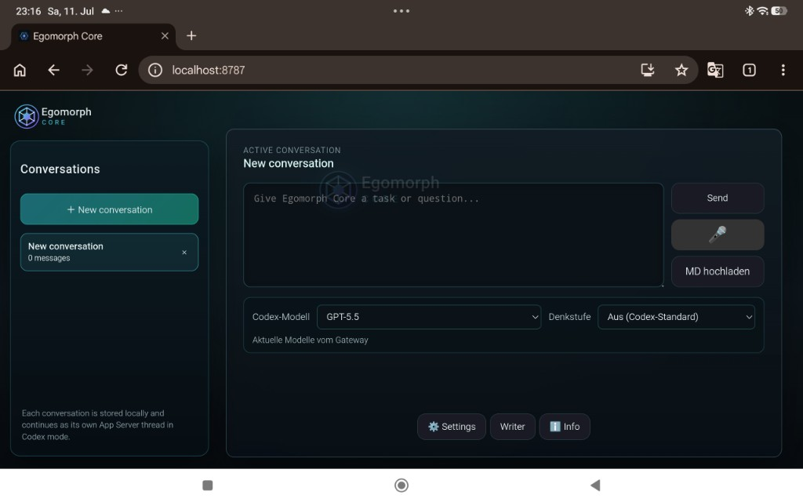

# Egomorph Core

EgoMorph Core is an open-source, gateway-first AI platform that combines local models, Codex integration, semantic skill orchestration, secure file access, persistent memory, and agentic workflows into a modular browser-based experience.

## Screenshots
<p align="center">
  
</p>

## Quick start

```bash
npm install
./egomorph codex login
./egomorph dashboard
```

The dashboard defaults to `http://localhost:8787/`.

## Features

- three generative profiles: local browser LLM, external API, and Codex
- multiple isolated local conversations
- interruptible Codex responses with a persistent App Server
- live Codex model catalog and reasoning controls
- live structured agent replies with a safe reasoning summary, visible skill-access status, and a token-by-token final answer
- manifest-driven skill system with installation, profiles, permission controls, and run history
- internet research skill with Google and fallback providers
- persistent memory and controlled Markdown file context
- integrated Writer agent
- installable PWA with an offline app shell
- abstract animated Egomorph Core logo

The former rule-based interaction paths and character are no longer part of the application. Replies come exclusively from a generative backend.

## Profiles

| Profile | Use |
| --- | --- |
| Local | Runs a Transformers.js `text-generation` model in the browser. |
| API | Connects OpenAI, OpenRouter, Ollama, LM Studio, or another compatible endpoint. |
| Codex | Uses the official Codex CLI through the local Egomorph Core gateway. |

## Codex and security

```bash
./egomorph codex login
./egomorph codex login --device-auth
./egomorph gateway
```

Egomorph Core does not read ChatGPT cookies, access tokens, or `auth.json`. The gateway binds to `127.0.0.1:8787` by default. Other browser origins must be explicitly allowed with `CODEX_BRIDGE_ALLOWED_ORIGINS`.

The model home is `<project folder>/EgomorphCore/model-home`. Codex may work with allowed Markdown files there but must stay inside this workspace. `memory.md` is reserved for memory; private model-home content must not be published.

Replies do not expose private chain-of-thought. Analysis and model work appear immediately, and the reasoning step is a short outcome-focused summary. A skill appears only for a real runtime access. Its status distinguishes a technical failure from a completed search without results and reports the number of sources actually passed to the model. Codex and streaming-capable APIs update the reasoning and final answer token by token. Internal model-home files, names, paths, and raw contents are never shown.

The active model decides semantically whether research is required, without keyword rules. When needed, it emits a structured skill call with its own query; the app runs the approved internet skill and returns its sources for a second final model turn. A word such as `search` does not trigger a skill by itself. Blocked model requests remain visible in the live step.

## Skills

Every skill has its own JSON manifest describing its ID, name, version, entrypoint, allowed profiles, required permissions, and setup fields; installed entrypoint scripts are loaded from it. `Settings -> Skills` supports installing or uninstalling skills, enabling them, assigning profiles, configuring them, and granting or revoking permissions. It also shows the last run. The built-in internet skill manifest is `skills/internet/manifest.json`; network access is required to run it, while use of stored Google credentials is a separate optional permission.

## Development

```bash
npm test -- --runInBand
npm run build:safetyfilter
npm run pwa:validate
```

See [doku.md](doku.md) for the detailed reference. License: MIT.
